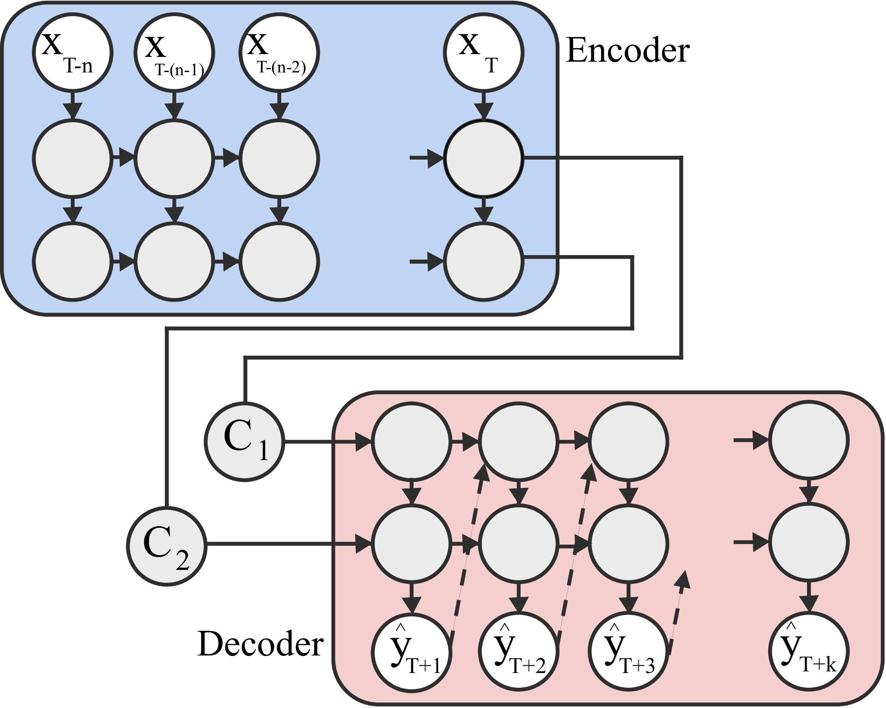

### A Deep Learning Model for Wireless Channel Quality Prediction ###

The code here contains a sequence-to-sequence LSTM/GRU based deep learning model used for wireless signal strength prediction. It is possible to train the model in three training paradigms of guided, unguided and curriculum training. Please refer the [paper](http://www.dinalherath.com/papers/2019ICC.pdf) for algorithm information. Note, an extended version of the work with more comparison is also available in this [paper](http://www.dinalherath.com/papers/2019tvt.pdf).

<p align="center">
  
</p>

#### Deep learning (LSTM and GRU) models:

- seq2seq_curriculum_LSTM.py => LSTM using curriculum training 30%
- seq2seq_guided_LSTM.py => LSTM using guided training
- seq2seq_unguided_LSTM.py => LSTM using unguided training
- seq2seq_unguided_GRU.py => GRU using unguided training
- calculateError.py, fileprocessor.py, preprocessor.py => contains helper functions

#### Data description:

All datasets are cleaned datasets. Reference for the raw data is mentioned below each network type.

**4G LTE RSRP Measurements:**
(Data Collected by the authors)
- 4G_bus_TMobile.txt
- 4G_pedestrian_TMobile.txt
- ATT_4G_bus.txt
- ATT_4G_pedestrian.txt

**Industrial Network Measurements:**
(Raw data can be found at this [link](https://crawdad.org/init/factory/20160613/factory1-channel-gain))
- s21_average_sweep.txt (antennas separated by a distance of 3.1m)
- s31_average_sweep.txt (antennas separated by a distance of 10.0m)
- s41_average_sweep.txt (antennas separated by a distance of 20.4m)

**WiFi RSI Measurements:**
(1st two datasets colleted by the authors)
- wifi_1s_sample.txt (sampling rate of 1 second)
- wifi_2s_sample.txt (sampling rate of 2 seconds)

**Zigbee Measurements:**
(Raw data can be found at this [link](https://crawdad.org/due/packet-delivery/20150401))
(Power level 31 considered)
- wsn_p31_d10_sample.txt (sensor nodes communicating with each other over fixed distance of 10m)
- wsn_p31_d15_sample.txt (sensor nodes communicating with each other over fixed distance of 15m)

```
@inproceedings{herath2019deep,
  title={A deep learning model for wireless channel quality prediction},
  author={Herath, J Dinal and Seetharam, Anand and Ramesh, Arti},
  booktitle={ICC 2019-2019 IEEE International Conference on Communications (ICC)},
  pages={1--6},
  year={2019},
  organization={IEEE}
}
```

```
@article{kulkarni2019deepchannel,
  title={Deepchannel: Wireless channel quality prediction using deep learning},
  author={Kulkarni, Adita and Seetharam, Anand and Ramesh, Arti and Herath, J Dinal},
  journal={IEEE Transactions on Vehicular Technology},
  volume={69},
  number={1},
  pages={443--456},
  year={2019},
  publisher={IEEE}
}
```
